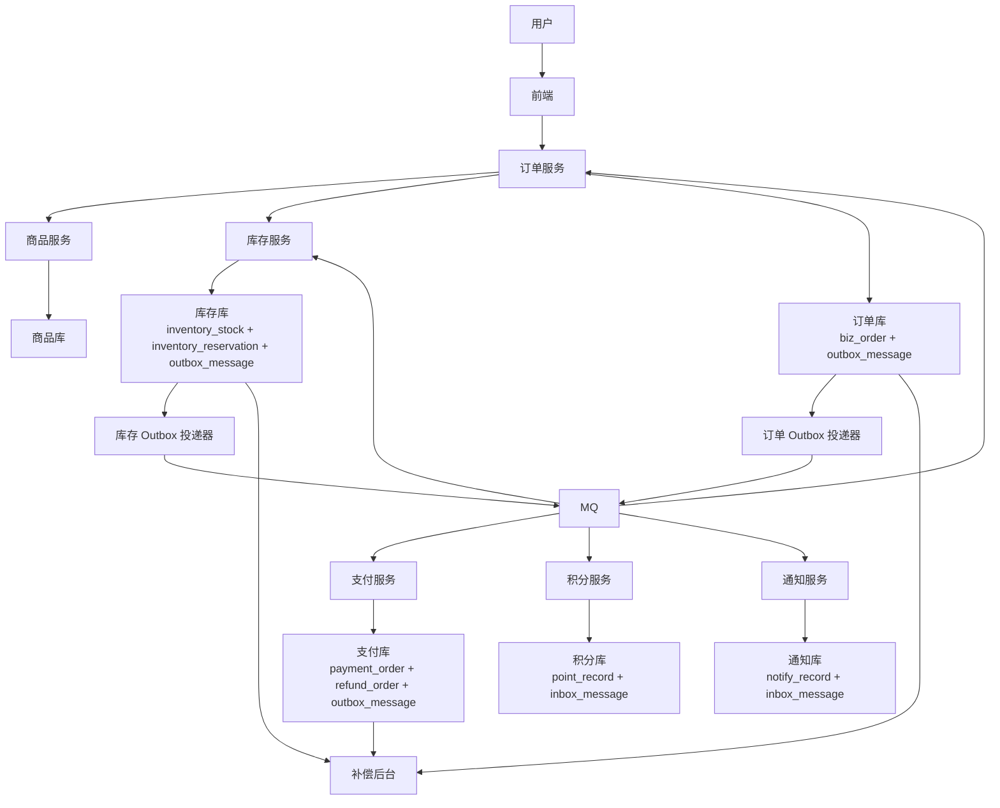
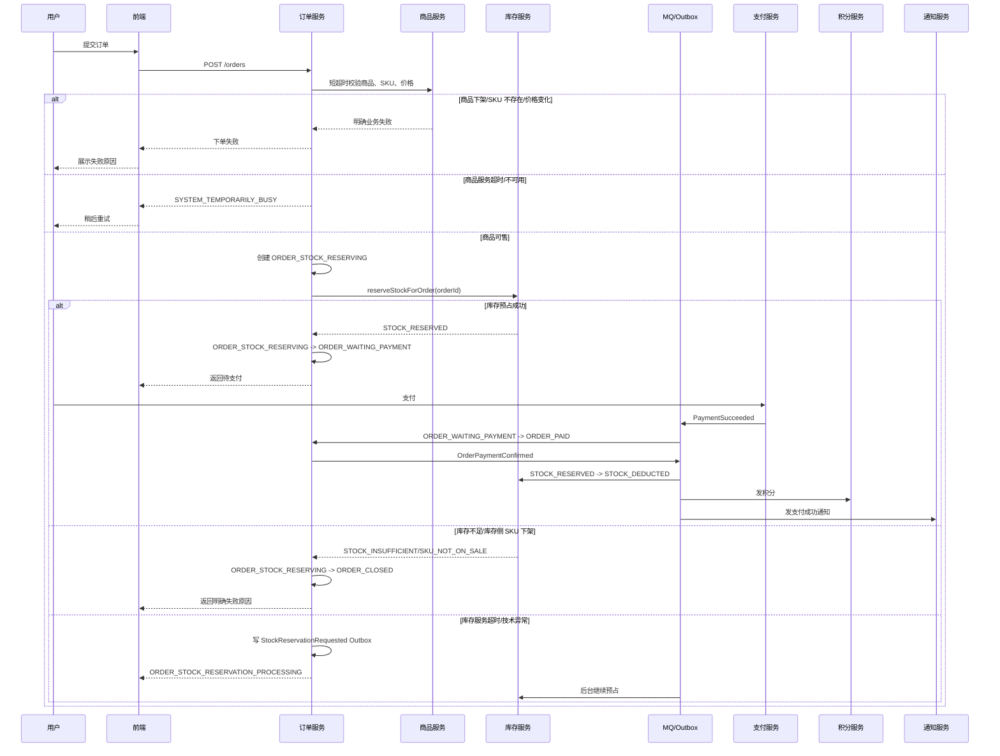
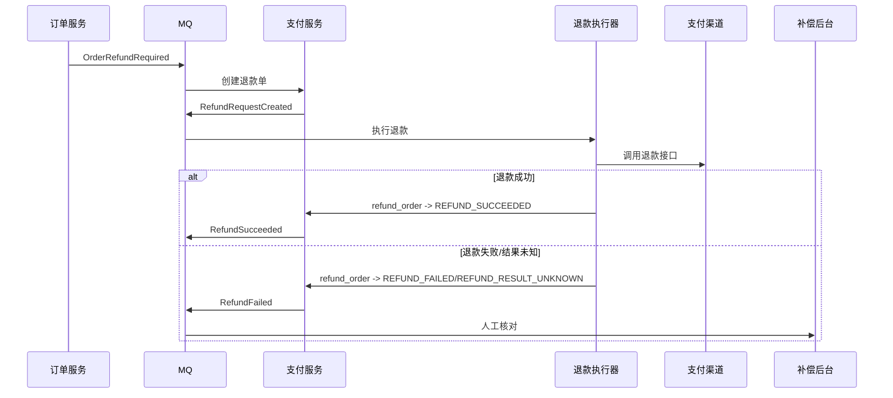

# 订单链路最终一致性工程方案

本文描述订单、商品、库存、支付、积分、通知之间的最终一致性方案。

核心结论：

- 订单调用商品、库存是分布式业务流程，不等于 XA/2PC 分布式事务。
- 同步链路只负责快速给用户明确结果。
- 异步链路负责最终一致、重试、对账和补偿。
- 每个服务只提交自己的本地事务。
- 本地事务内不能调用远程服务、MQ 或支付渠道。
- 明确业务失败要快速失败；技术异常不能伪装成库存不足。
- 库存预占必须整体成功或整体失败，多 SKU 不能半成功。

## 1. 目标和边界

目标：

- 用户下单时，商品下架、库存不足、价格变化等确定业务失败要快速返回。
- 技术异常不能误判为业务失败，避免错误关闭订单。
- 支付成功、库存扣减、积分发放、通知发送最终一致。
- 消息重复、乱序、延迟时，状态不能被写坏。
- 服务短暂故障时，任务不丢，可重试、可观测、可人工补偿。

不做：

- 不做订单库、库存库、支付库之间的 XA/2PC 强事务。
- 不依赖 MQ exactly-once。
- 不把库存服务超时当成库存不足。
- 不把退款、通知、积分放进订单本地事务。

## 2. 服务职责

| 服务 | 职责 | 本地事务内保证 |
|---|---|---|
| 商品服务 | 商品、SKU、价格、上下架状态 | 商品状态和价格快照读取一致 |
| 订单服务 | 订单创建、订单状态机、关单、订单查询 | 订单状态变更和订单 Outbox 同事务 |
| 库存服务 | 库存预占、确认扣减、释放库存 | 库存数量、预占记录、库存 Outbox 同事务 |
| 支付服务 | 支付单、支付回调、退款单、退款执行 | 支付/退款状态和支付 Outbox 同事务 |
| 积分服务 | 支付后发积分 | 积分记录按订单幂等 |
| 通知服务 | 短信、站内信、Webhook | 通知记录按业务维度幂等 |
| 补偿后台 | 查询链路、重试、终止、人工确认 | 所有人工动作留痕 |

## 3. 总体架构



## 4. 主流程



## 5. 状态命名

订单状态：

| 状态 | 含义 | 允许进入方式 |
|---|---|---|
| ORDER_STOCK_RESERVING | 库存预占中 | 创建订单后进入 |
| ORDER_WAITING_PAYMENT | 待支付 | 库存预占成功 |
| ORDER_PAID | 已支付 | 支付成功消息确认 |
| ORDER_CLOSED | 已关闭 | 库存失败、商品不可售、支付超时、用户取消 |

订单状态约束：

- 只有 `ORDER_STOCK_RESERVING` 可以变成 `ORDER_WAITING_PAYMENT`。
- 只有 `ORDER_STOCK_RESERVING` 可以因为库存失败变成 `ORDER_CLOSED`。
- 只有 `ORDER_WAITING_PAYMENT` 可以因为支付成功变成 `ORDER_PAID`。
- 只有 `ORDER_WAITING_PAYMENT` 可以因为支付超时变成 `ORDER_CLOSED`。
- `ORDER_PAID` 是订单支付成功终态；库存确认、积分、通知是支付后的异步子流程。

库存预占状态：

| 状态 | 含义 |
|---|---|
| STOCK_RESERVED | 已预占 |
| STOCK_DEDUCTED | 已确认扣减 |
| STOCK_RELEASED | 已释放 |

支付状态：

| 状态 | 含义 |
|---|---|
| PAYMENT_PROCESSING | 支付处理中 |
| PAYMENT_SUCCEEDED | 支付成功 |
| PAYMENT_FAILED | 支付失败 |
| PAYMENT_RESULT_UNKNOWN | 渠道结果未知 |

退款状态：

| 状态 | 含义 |
|---|---|
| REFUND_PROCESSING | 退款处理中 |
| REFUND_SUCCEEDED | 退款成功 |
| REFUND_FAILED | 退款明确失败 |
| REFUND_RESULT_UNKNOWN | 渠道结果未知 |

消息状态：

| 状态 | 含义 |
|---|---|
| MESSAGE_PENDING | 待投递 |
| MESSAGE_SENDING | 投递中 |
| MESSAGE_SENT | 投递成功 |
| MESSAGE_RETRYABLE_FAILED | 可重试失败 |
| MESSAGE_DEAD | 超过重试次数，等待人工处理 |
| MESSAGE_CANCELLED | 人工终止 |

## 6. 事件命名

| 事件 | 生产方 | 消费方 | 说明 |
|---|---|---|---|
| StockReservationRequested | 订单服务 | 库存服务 | 库存同步调用技术不确定后的异步预占 |
| StockReservationSucceeded | 库存服务 | 订单服务 | 库存预占成功 |
| StockReservationRejected | 库存服务 | 订单服务 | 库存预占明确业务失败 |
| PaymentSucceeded | 支付服务 | 订单服务 | 支付成功原始事件，只允许订单服务消费并裁决 |
| OrderPaymentConfirmed | 订单服务 | 库存、积分、通知 | 订单确认已支付后的领域事件 |
| OrderRefundRequired | 订单服务 | 支付服务 | 支付成功但订单已关闭，需要退款 |
| RefundRequestCreated | 支付服务 | 退款执行器 | 退款单已创建，等待调用渠道 |
| RefundSucceeded | 支付服务 | 订单服务/补偿后台 | 退款成功 |
| RefundFailed | 支付服务 | 补偿后台 | 退款失败 |
| OrderClosed | 订单服务 | 库存服务 | 订单关闭后释放预占库存 |
| StockDeductionConfirmed | 库存服务 | 订单服务/补偿后台 | 库存确认扣减完成 |
| StockReservationReleased | 库存服务 | 订单服务/补偿后台 | 库存释放完成 |
| OrderPaymentStateException | 订单服务 | 补偿后台 | 支付成功但订单状态异常 |
| StockDeductionConfirmationFailed | 库存服务 | 补偿后台 | 库存确认扣减异常 |
| StockReservationReleaseFailed | 库存服务 | 补偿后台 | 库存释放异常 |

事件去重键建议：

| 事件 | dedupe_key |
|---|---|
| StockReservationRequested | `StockReservationRequested:{orderId}:{orderVersion}` |
| StockReservationSucceeded | `StockReservationSucceeded:{orderId}` |
| StockReservationRejected | `StockReservationRejected:{orderId}` |
| PaymentSucceeded | `PaymentSucceeded:{payNo}` |
| OrderPaymentConfirmed | `OrderPaymentConfirmed:{orderId}` |
| OrderRefundRequired | `OrderRefundRequired:{orderId}:{payNo}` |
| RefundRequestCreated | `RefundRequestCreated:{refundNo}` |
| RefundSucceeded | `RefundSucceeded:{refundNo}` |
| RefundFailed | `RefundFailed:{refundNo}` |
| OrderClosed | `OrderClosed:{orderId}` |
| StockDeductionConfirmed | `StockDeductionConfirmed:{orderId}` |
| StockReservationReleased | `StockReservationReleased:{orderId}` |

`message_id` 解决消息身份，`dedupe_key` 解决业务语义去重。所有 Outbox 事件必须提供非空 `dedupe_key`。

## 7. 核心数据模型

只保留关键字段，具体索引可按查询和扫描任务补充。

| 表 | 关键字段 | 约束 |
|---|---|---|
| biz_order | order_id、order_no、user_id、status、total_amount、paid_pay_no、pay_deadline、close_reason、version、trace_id | `order_no` 唯一；状态流转使用条件更新 |
| inventory_stock | sku_id、status、available_stock、locked_stock、version | 预占使用 `available_stock >= quantity` 条件更新 |
| inventory_reservation | order_id、sku_id、quantity、status、version、trace_id | `order_id + sku_id` 唯一 |
| payment_order | pay_no、order_id、amount、status、channel_trade_no、paid_time、trace_id | `pay_no` 唯一 |
| refund_order | refund_no、pay_no、order_id、amount、status、channel_refund_no、trace_id | `refund_no` 唯一；`order_id + pay_no` 唯一 |
| outbox_message | message_id、event_type、biz_id、dedupe_key、payload、status、retry_count、next_retry_time、trace_id | `message_id` 唯一；`dedupe_key` 唯一 |
| inbox_message | message_id、consumer_group、event_type、biz_id、status、trace_id | `message_id + consumer_group` 唯一 |
| point_record | order_id、user_id、points、status、source_event_id、trace_id | `order_id` 唯一 |
| notify_record | biz_id、template_code、receiver、channel、status、source_event_id、trace_id | `biz_id + template_code + receiver` 唯一 |

关键条件更新：

```sql
UPDATE biz_order
SET status = 'ORDER_WAITING_PAYMENT', version = version + 1
WHERE id = #{orderId}
  AND status = 'ORDER_STOCK_RESERVING';
```

```sql
UPDATE biz_order
SET status = 'ORDER_PAID',
    paid_pay_no = #{payNo},
    version = version + 1
WHERE id = #{orderId}
  AND status = 'ORDER_WAITING_PAYMENT';
```

```sql
UPDATE inventory_stock
SET available_stock = available_stock - #{quantity},
    locked_stock = locked_stock + #{quantity},
    version = version + 1
WHERE sku_id = #{skuId}
  AND status = 'SKU_ON_SALE'
  AND available_stock >= #{quantity};
```

## 8. 快速失败

快速失败只处理确定的业务失败。

| 场景 | 是否快速失败 | 用户提示 | 后续动作 |
|---|---:|---|---|
| 商品下架 | 是 | 商品已下架 | 不创建有效订单，或订单 ORDER_CLOSED |
| SKU 不存在 | 是 | 商品不存在 | 不创建有效订单，或订单 ORDER_CLOSED |
| 价格变化 | 是 | 价格发生变化，请刷新订单 | 不创建有效订单，或订单 ORDER_CLOSED |
| 库存不足 | 是 | 库存不足 | 订单 ORDER_CLOSED |
| 限购不满足 | 是 | 超过限购数量 | 订单 ORDER_CLOSED |
| 商品服务超时 | 否 | 系统繁忙，请稍后重试 | 通常不创建订单 |
| 库存服务超时 | 否 | 订单处理中 | 订单 ORDER_STOCK_RESERVING，后台继续预占 |
| 数据库死锁/连接池满 | 否 | 订单处理中或系统繁忙 | 重试或补偿 |
| MQ 投递失败 | 否 | 不直接影响用户 | Outbox 重试 |

原则：

- 明确业务失败，立即告诉用户。
- 技术不确定失败，不能告诉用户库存不足。
- 不确定结果进入处理中、重试或补偿。

## 9. 关键流程规则

### 9.1 下单和库存预占

1. 订单服务先短超时校验商品。
2. 商品业务失败直接返回，不进入库存预占。
3. 商品可售后创建 `ORDER_STOCK_RESERVING`。
4. 同步调用库存 `reserveStockForOrder(orderId)`。
5. 库存返回 `STOCK_RESERVED` 时，订单改为 `ORDER_WAITING_PAYMENT`。
6. 库存返回 `STOCK_INSUFFICIENT` 或 `SKU_NOT_ON_SALE` 时，订单改为 `ORDER_CLOSED`。
7. 库存技术异常时，写 `StockReservationRequested`，返回 `ORDER_STOCK_RESERVATION_PROCESSING`。

库存预占要求：

- 多 SKU 必须整体成功或整体回滚。
- 任意 SKU 库存不足、下架或不存在，整个库存事务回滚。
- 预占成功后，库存数量、预占记录、`StockReservationSucceeded` Outbox 必须同事务提交。
- 异步预占消费前必须查询订单状态；只有 `ORDER_STOCK_RESERVING` 可以继续预占。

### 9.2 支付成功

支付服务收到渠道成功回调后：

1. 支付服务把支付单改为 `PAYMENT_SUCCEEDED`。
2. 同一事务写 `PaymentSucceeded` Outbox。
3. 订单服务消费 `PaymentSucceeded`。
4. 只有 `ORDER_WAITING_PAYMENT` 可以改为 `ORDER_PAID`。
5. 订单成功变为 `ORDER_PAID` 后写 `OrderPaymentConfirmed`。
6. 库存、积分、通知只消费 `OrderPaymentConfirmed`，不直接消费 `PaymentSucceeded`。

订单服务裁决规则：

| 订单状态 | 处理 |
|---|---|
| ORDER_WAITING_PAYMENT | 改为 ORDER_PAID，写 OrderPaymentConfirmed |
| ORDER_PAID 且 paid_pay_no 相同 | 幂等忽略 |
| ORDER_PAID 且 paid_pay_no 不同 | 写 OrderRefundRequired |
| ORDER_CLOSED | 写 OrderRefundRequired |
| ORDER_STOCK_RESERVING | 写 OrderPaymentStateException，补偿后台核对 |

### 9.3 超时关单和释放库存

1. 关单任务扫描超过 `pay_deadline` 的 `ORDER_WAITING_PAYMENT`。
2. 条件更新为 `ORDER_CLOSED`。
3. 同一事务写 `OrderClosed` Outbox。
4. 库存服务消费 `OrderClosed`。
5. `STOCK_RESERVED -> STOCK_RELEASED`，回补 `available_stock`，减少 `locked_stock`。

释放规则：

- 全部 `STOCK_RESERVED` 才能释放。
- 全部 `STOCK_RELEASED` 幂等忽略。
- 空集合、混合状态、包含 `STOCK_DEDUCTED`，写 `StockReservationReleaseFailed` 进入补偿。

### 9.4 退款闭环

`OrderRefundRequired` 不能只告警，必须形成退款单。



退款要求：

- 退款单按 `order_id + pay_no` 幂等。
- 消费 `OrderRefundRequired` 只创建退款单，不能在本地事务里调用支付渠道。
- 渠道结果未知时必须定时查询，不能标记成功。
- 订单主状态保持 `ORDER_CLOSED`，退款状态看 `refund_order`。

## 10. 异常处理矩阵

| 异常点 | 当前状态 | 处理方式 | 用户是否立即失败 |
|---|---|---|---:|
| 商品下架/不存在/价格变化 | 订单未创建或 ORDER_STOCK_RESERVING | 快速失败或 ORDER_CLOSED | 是 |
| 商品服务超时 | 订单未创建 | 返回 SYSTEM_TEMPORARILY_BUSY | 否 |
| 库存不足/库存侧下架 | ORDER_STOCK_RESERVING | ORDER_CLOSED | 是 |
| 库存服务超时 | ORDER_STOCK_RESERVING | 返回处理中，写 StockReservationRequested | 否 |
| 订单改待支付失败 | 库存可能 STOCK_RESERVED | StockReservationSucceeded 或对账修正 | 否 |
| 支付成功后订单服务挂 | 支付 PAYMENT_SUCCEEDED，订单未更新 | PaymentSucceeded 重试 | 否 |
| 支付成功但订单已关闭 | ORDER_CLOSED | OrderRefundRequired | 否 |
| 支付成功但订单仍预占中 | ORDER_STOCK_RESERVING | OrderPaymentStateException | 否 |
| 库存确认扣减失败 | ORDER_PAID，库存 STOCK_RESERVED | OrderPaymentConfirmed 重试或补偿 | 否 |
| 关单释放库存失败 | ORDER_CLOSED，库存 STOCK_RESERVED | OrderClosed 重试或补偿 | 否 |
| MQ 重复/乱序 | 任意 | Inbox 幂等 + 状态机条件更新 | 否 |
| 消息长期失败 | MESSAGE_DEAD | 告警 + 人工补偿 | 否 |

## 11. 对账和补偿

订单服务扫描：

| 条件 | 处理 |
|---|---|
| ORDER_STOCK_RESERVING 超过 30 秒 | 查询库存 reservation |
| 库存 STOCK_RESERVED | 订单改 ORDER_WAITING_PAYMENT |
| 库存明确无 reservation 且库存服务可用 | 重新 reserveStockForOrder |
| 库存明确业务失败 | 订单 ORDER_CLOSED |
| 多次不确定 | 进入补偿后台 |

库存服务扫描：

| 条件 | 处理 |
|---|---|
| STOCK_RESERVED 但订单 ORDER_CLOSED | 释放库存 |
| STOCK_RESERVED 但订单 ORDER_PAID | 确认扣减 |
| STOCK_RESERVED 超过支付超时时间 | 查询订单状态后释放或保留 |

支付服务扫描：

| 条件 | 处理 |
|---|---|
| 渠道已支付但本地支付单未 PAYMENT_SUCCEEDED | 补写支付单和 PaymentSucceeded Outbox |
| 本地支付单 PAYMENT_SUCCEEDED 但订单未 ORDER_PAID | 重投 PaymentSucceeded，由订单服务裁决 |
| 退款单 REFUND_RESULT_UNKNOWN | 查询渠道退款状态 |

补偿后台必须支持：

- 按 `orderId`、`messageId`、`traceId` 查询链路。
- 查看订单、库存预占、支付、退款、积分、通知状态。
- 查看 Outbox/Inbox 状态、重试次数、最后错误。
- 手动重试消息。
- 人工终止消息。
- 人工释放库存。
- 人工确认业务已完成。
- 所有人工动作记录操作人、原因、前后状态和 traceId。

## 12. 接口契约

商品校验：

```text
POST /products/check-sale
```

成功：

```json
{
  "success": true,
  "code": "PRODUCT_SALEABLE",
  "message": "可售"
}
```

业务失败：

```json
{
  "success": false,
  "code": "SKU_NOT_ON_SALE",
  "message": "商品已下架"
}
```

库存预占：

```text
POST /inventory/reservations
```

成功：

```json
{
  "success": true,
  "code": "STOCK_RESERVED",
  "message": "预占成功"
}
```

业务失败：

```json
{
  "success": false,
  "code": "STOCK_INSUFFICIENT",
  "message": "库存不足"
}
```

技术失败：

```json
{
  "success": false,
  "code": "TEMPORARY_TECHNICAL_ERROR",
  "message": "库存服务暂时不可用"
}
```

## 13. 监控告警

| 指标 | 告警建议 |
|---|---|
| ORDER_STOCK_RESERVING 订单数量 | 连续增长告警 |
| ORDER_STOCK_RESERVING 最长滞留时间 | 超过 1 分钟告警 |
| ORDER_WAITING_PAYMENT 超时未关闭数量 | 大于 0 告警 |
| MESSAGE_RETRYABLE_FAILED 数量 | 连续增长告警 |
| MESSAGE_DEAD 数量 | 大于 0 告警 |
| PaymentSucceeded 未完成消费数量 | 超过阈值告警 |
| OrderPaymentConfirmed 未完成消费数量 | 超过阈值告警 |
| OrderRefundRequired/OrderPaymentStateException 数量 | 大于 0 告警 |
| RefundFailed/REFUND_RESULT_UNKNOWN 数量 | 大于 0 告警 |
| StockDeductionConfirmationFailed/StockReservationReleaseFailed 数量 | 大于 0 告警 |
| STOCK_RESERVED 库存滞留数量 | 超过阈值告警 |
| 商品/库存服务熔断次数 | 连续触发告警 |

## 14. 落地清单

- 订单、库存、支付服务接入 Outbox。
- 所有消费者接入 Inbox 幂等。
- 所有状态流转使用条件更新。
- 库存预占使用库存条件更新，避免超卖。
- 多 SKU 库存预占整体成功或整体回滚。
- `StockReservationRequested` 消费前校验订单状态和消息版本。
- `PaymentSucceeded` 只允许订单服务消费并裁决。
- 库存、积分、通知只消费 `OrderPaymentConfirmed`。
- 支付成功但订单关闭必须进入退款闭环。
- 退款渠道调用必须由退款执行器处理。
- Outbox 事件必须提供非空 `dedupe_key`。
- ORDER_STOCK_RESERVING 订单要有自动补偿任务。
- ORDER_WAITING_PAYMENT 订单要有超时关单任务。
- STOCK_RESERVED 库存要有确认扣减和释放对账任务。
- 补偿后台支持查链路、重试、终止、人工确认。
- 所有消息和关键日志带 `traceId`。

## 15. 最终原则

```text
快速失败：只失败确定的业务错误。
快速保护：技术异常不乱判业务失败。
本地事务：每个服务只保证自己的数据正确。
最终一致：靠 Outbox、MQ、Inbox、状态机、重试、对账、补偿收敛。
工程兜底：所有失败可查、可重试、可人工处理。
```
