# 订单链路最终一致性工程方案

本文描述订单、商品、库存、支付、积分、通知之间的工程级一致性方案。

核心结论：

- 订单调用商品、库存属于分布式业务流程，不等于 XA/2PC 分布式事务。
- 同步链路负责快速给用户明确结果。
- 异步链路负责最终一致、重试和补偿。
- 每个服务只提交自己的本地事务。
- Java 工程实现建议使用 `TransactionTemplate` 显式包住本地事务边界，避免在脚手架层默认引入声明式事务口径。
- 跨服务一致性靠状态机、Outbox、MQ、Inbox 幂等、重试、对账和人工补偿收敛。
- 文中的“任务/扫描”建议由 `framework-job` 对接 XXL-JOB 或外部调度触发，保持 `framework-starter` 默认不依赖调度平台。

## 1. 目标和边界

### 1.1 目标

- 用户下单时，库存不足、商品下架等确定业务失败要尽快返回。
- 技术异常不能误判为库存不足，避免错误关闭订单。
- 支付成功、库存扣减、积分发放、通知发送最终一致。
- 任意消息重复、乱序、延迟时，业务状态不能被写坏。
- 任意服务短暂故障时，任务不丢，可重试、可观测、可人工补偿。

### 1.2 不做什么

- 不做订单库、库存库、支付库之间的 XA/2PC 强事务。
- 不在订单本地数据库事务里调用库存、支付、通知等远程服务。
- 不依赖 MQ exactly-once 语义。
- 不把技术超时伪装成库存不足。

## 2. 服务职责

| 服务 | 职责 | 本地事务内必须保证 |
|---|---|---|
| 商品服务 | 商品、SKU、价格、上下架状态 | 商品状态和价格快照读取一致 |
| 订单服务 | 订单创建、状态机、关单、对外查询 | 订单状态变更和订单 Outbox 同事务 |
| 库存服务 | 预占库存、确认扣减、释放库存 | 库存数量、预占记录、库存 Outbox 同事务 |
| 支付服务 | 支付单、支付回调、支付状态 | 支付状态和 PaymentPaid Outbox 同事务 |
| 积分服务 | 支付后发积分 | 积分记录幂等落库 |
| 通知服务 | 短信、站内信、Webhook | 通知记录幂等落库，失败可重试 |
| 补偿后台 | 查询、重试、终止、人工成功 | 记录操作人、原因、traceId 和状态流转 |

## 3. 总体架构

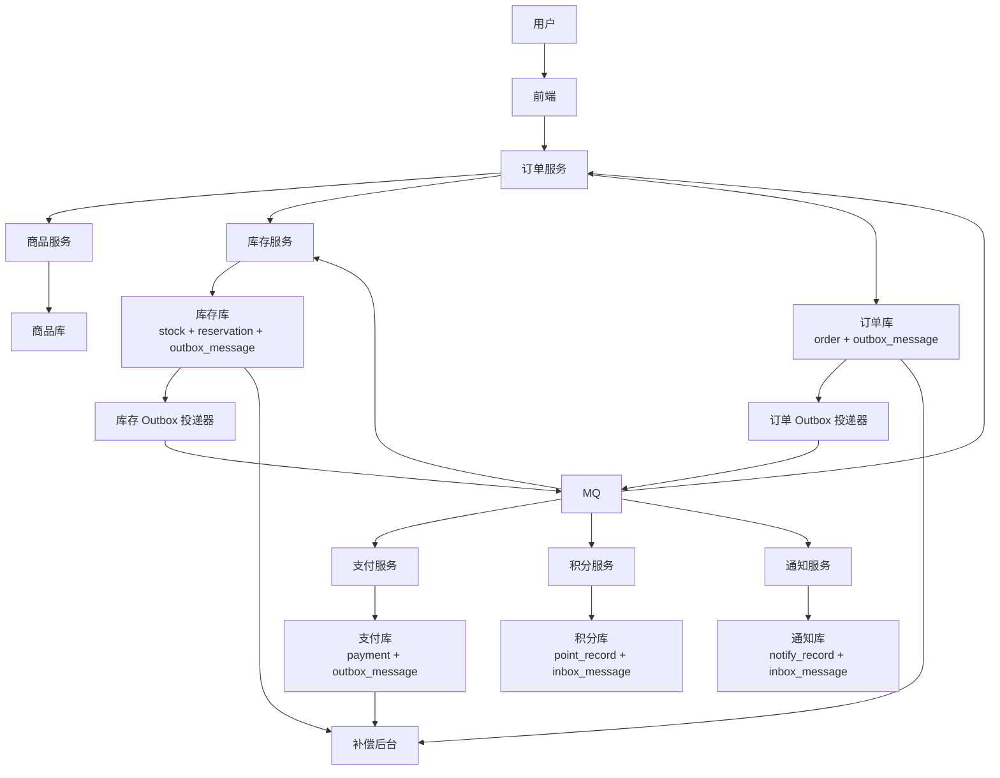
```mermaid
flowchart TD
  U["用户"] --> W["前端"]
  W --> O["订单服务"]

  O --> P["商品服务"]
  O --> I["库存服务"]
  O --> ODB["订单库<br/>order + outbox_message"]
  I --> IDB["库存库<br/>stock + reservation + outbox_message"]
  P --> PDB["商品库"]

  ODB --> OP["订单 Outbox 投递器"]
  IDB --> IP["库存 Outbox 投递器"]
  OP --> MQ["MQ"]
  IP --> MQ

  MQ --> PAY["支付服务"]
  MQ --> POINT["积分服务"]
  MQ --> N["通知服务"]
  MQ --> O
  MQ --> I

  PAY --> PAYDB["支付库<br/>payment + outbox_message"]
  POINT --> POINTDB["积分库<br/>point_record + inbox_message"]
  N --> NDB["通知库<br/>notify_record + inbox_message"]

  ODB --> A["补偿后台"]
  IDB --> A
  PAYDB --> A
```

## 4. 订单主流程

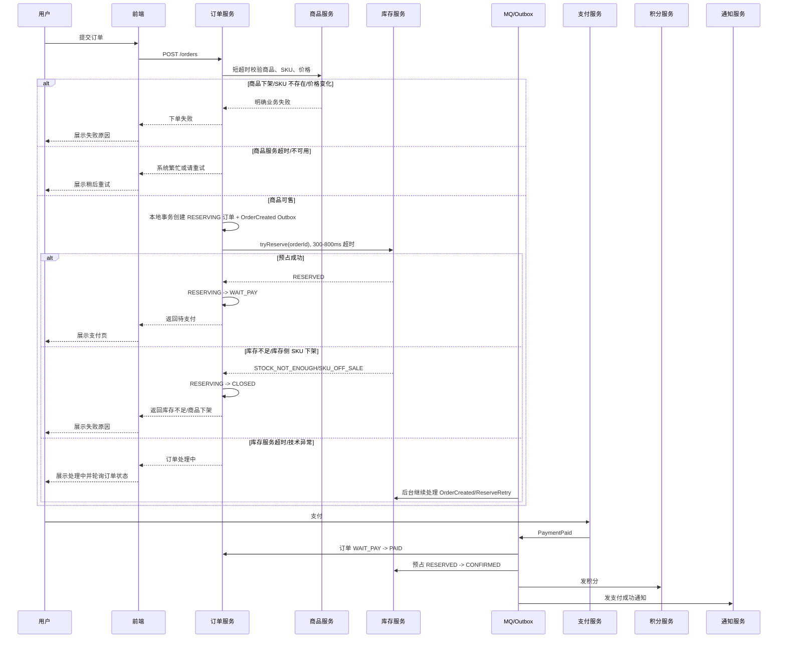
```mermaid
sequenceDiagram
  participant User as 用户
  participant Web as 前端
  participant Order as 订单服务
  participant Product as 商品服务
  participant Inventory as 库存服务
  participant MQ as MQ/Outbox
  participant Pay as 支付服务
  participant Point as 积分服务
  participant Notify as 通知服务

  User->>Web: 提交订单
  Web->>Order: POST /orders
  Order->>Product: 短超时校验商品、SKU、价格

  alt 商品下架/SKU 不存在/价格变化
    Product-->>Order: 明确业务失败
    Order-->>Web: 下单失败
    Web-->>User: 展示失败原因
  else 商品服务超时/不可用
    Order-->>Web: 系统繁忙或请重试
    Web-->>User: 展示稍后重试
  else 商品可售
    Order->>Order: 本地事务创建 RESERVING 订单 + OrderCreated Outbox
    Order->>Inventory: tryReserve(orderId), 300-800ms 超时

    alt 预占成功
      Inventory-->>Order: RESERVED
      Order->>Order: RESERVING -> WAIT_PAY
      Order-->>Web: 返回待支付
      Web-->>User: 展示支付页
    else 库存不足/库存侧 SKU 下架
      Inventory-->>Order: STOCK_NOT_ENOUGH/SKU_OFF_SALE
      Order->>Order: RESERVING -> CLOSED
      Order-->>Web: 返回库存不足/商品下架
      Web-->>User: 展示失败原因
    else 库存服务超时/技术异常
      Order-->>Web: 订单处理中
      Web-->>User: 展示处理中并轮询订单状态
      MQ->>Inventory: 后台继续处理 OrderCreated/ReserveRetry
    end
  end

  User->>Pay: 支付
  Pay->>MQ: PaymentPaid
  MQ->>Order: 订单 WAIT_PAY -> PAID
  MQ->>Inventory: 预占 RESERVED -> CONFIRMED
  MQ->>Point: 发积分
  MQ->>Notify: 发支付成功通知
```

## 5. 订单状态机

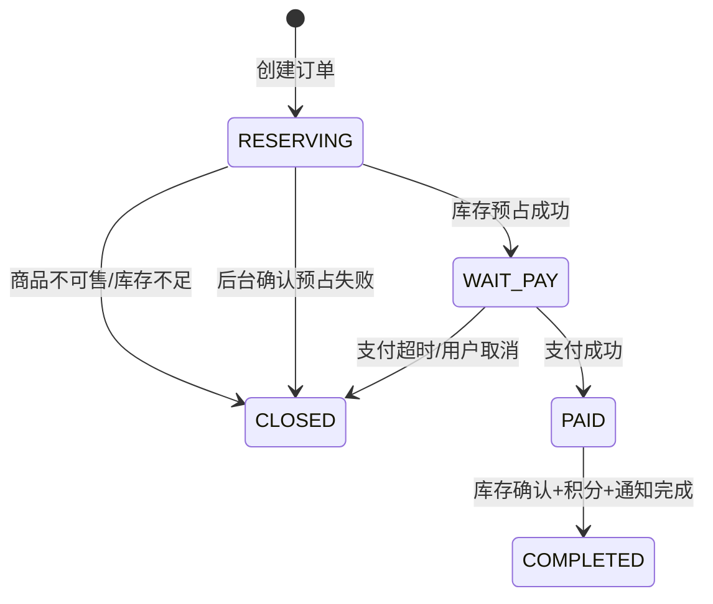
```mermaid
stateDiagram-v2
  [*] --> RESERVING: 创建订单
  RESERVING --> WAIT_PAY: 库存预占成功
  RESERVING --> CLOSED: 商品不可售/库存不足
  RESERVING --> CLOSED: 后台确认预占失败
  WAIT_PAY --> PAID: 支付成功
  WAIT_PAY --> CLOSED: 支付超时/用户取消
  PAID --> COMPLETED: 库存确认+积分+通知完成
```

订单状态说明：

| 状态 | 含义 | 允许进入方式 |
|---|---|---|
| RESERVING | 库存确认中 | 创建订单后进入 |
| WAIT_PAY | 待支付 | 库存预占成功 |
| PAID | 已支付 | 支付成功消息确认 |
| CLOSED | 已关闭 | 库存失败、商品不可售、支付超时、用户取消 |
| COMPLETED | 完成 | 支付后附属动作完成或可异步完成 |

状态机约束：

- 只有 `RESERVING` 可以变成 `WAIT_PAY`。
- 只有 `RESERVING` 可以因为库存失败变成 `CLOSED`。
- 只有 `WAIT_PAY` 可以因为支付成功变成 `PAID`。
- 只有 `WAIT_PAY` 可以因为支付超时变成 `CLOSED`。
- 消费重复消息时，如果当前状态不允许流转，直接幂等忽略。

## 6. 库存状态机

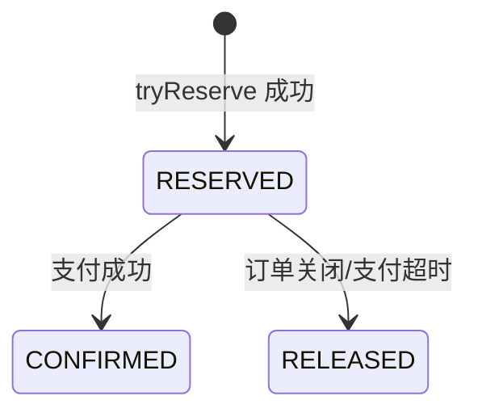
```mermaid
stateDiagram-v2
  [*] --> RESERVED: tryReserve 成功
  RESERVED --> CONFIRMED: 支付成功
  RESERVED --> RELEASED: 订单关闭/支付超时
```

库存字段：

| 字段 | 含义 |
|---|---|
| available_stock | 可售库存 |
| locked_stock | 预占库存 |

库存预占记录：

| 字段 | 含义 |
|---|---|
| order_id | 订单 ID |
| sku_id | SKU ID |
| quantity | 预占数量 |
| status | RESERVED/CONFIRMED/RELEASED |

关键唯一键：

```text
inventory_reservation(order_id, sku_id)
```

## 7. 核心表设计

### 7.1 订单表

```sql
CREATE TABLE biz_order (
  id BIGINT PRIMARY KEY,
  order_no VARCHAR(64) NOT NULL,
  user_id BIGINT NOT NULL,
  status VARCHAR(32) NOT NULL,
  total_amount DECIMAL(18,2) NOT NULL,
  close_reason VARCHAR(255) DEFAULT NULL,
  trace_id VARCHAR(64) DEFAULT NULL,
  create_time DATETIME NOT NULL,
  update_time DATETIME NOT NULL,
  UNIQUE KEY uk_order_no (order_no),
  KEY idx_user_status (user_id, status)
);
```

### 7.2 库存表

```sql
CREATE TABLE inventory_stock (
  sku_id BIGINT PRIMARY KEY,
  status VARCHAR(32) NOT NULL,
  available_stock INT NOT NULL,
  locked_stock INT NOT NULL,
  update_time DATETIME NOT NULL
);
```

### 7.3 库存预占表

```sql
CREATE TABLE inventory_reservation (
  id BIGINT PRIMARY KEY AUTO_INCREMENT,
  order_id BIGINT NOT NULL,
  sku_id BIGINT NOT NULL,
  quantity INT NOT NULL,
  status VARCHAR(32) NOT NULL,
  trace_id VARCHAR(64) DEFAULT NULL,
  create_time DATETIME NOT NULL,
  update_time DATETIME NOT NULL,
  UNIQUE KEY uk_order_sku (order_id, sku_id),
  KEY idx_order (order_id)
);
```

### 7.4 Outbox 本地消息表

```sql
CREATE TABLE outbox_message (
  id BIGINT PRIMARY KEY AUTO_INCREMENT,
  message_id VARCHAR(64) NOT NULL,
  topic VARCHAR(128) NOT NULL,
  event_type VARCHAR(128) NOT NULL,
  biz_id VARCHAR(128) NOT NULL,
  payload JSON NOT NULL,
  headers JSON DEFAULT NULL,
  status VARCHAR(32) NOT NULL,
  retry_count INT NOT NULL DEFAULT 0,
  max_retry_count INT NOT NULL DEFAULT 10,
  next_retry_time DATETIME NOT NULL,
  locked_by VARCHAR(128) DEFAULT NULL,
  lock_until DATETIME DEFAULT NULL,
  last_error TEXT DEFAULT NULL,
  trace_id VARCHAR(64) DEFAULT NULL,
  create_time DATETIME NOT NULL,
  update_time DATETIME NOT NULL,
  UNIQUE KEY uk_message_id (message_id),
  KEY idx_status_next_retry (status, next_retry_time),
  KEY idx_biz (event_type, biz_id)
);
```

Outbox 状态：

| 状态 | 含义 |
|---|---|
| PENDING | 待投递 |
| SENDING | 投递中 |
| SENT | 投递成功 |
| FAILED | 可重试失败 |
| DEAD | 超过重试次数，等待人工处理 |
| CANCELLED | 人工终止 |

### 7.5 Inbox 消费幂等表

```sql
CREATE TABLE inbox_message (
  id BIGINT PRIMARY KEY AUTO_INCREMENT,
  message_id VARCHAR(64) NOT NULL,
  consumer_group VARCHAR(128) NOT NULL,
  event_type VARCHAR(128) NOT NULL,
  biz_id VARCHAR(128) NOT NULL,
  status VARCHAR(32) NOT NULL,
  error_message TEXT DEFAULT NULL,
  trace_id VARCHAR(64) DEFAULT NULL,
  create_time DATETIME NOT NULL,
  update_time DATETIME NOT NULL,
  UNIQUE KEY uk_message_consumer (message_id, consumer_group)
);
```

## 8. 快速失败策略

快速失败只处理确定的业务失败。

| 场景 | 是否快速失败 | 用户提示 | 后续动作 |
|---|---:|---|---|
| 商品下架 | 是 | 商品已下架 | 不创建有效订单，或订单 CLOSED |
| SKU 不存在 | 是 | 商品不存在 | 不创建有效订单，或订单 CLOSED |
| 价格变化 | 是 | 价格发生变化，请刷新订单 | 不创建有效订单，或订单 CLOSED |
| 库存不足 | 是 | 库存不足 | 订单 CLOSED |
| 限购不满足 | 是 | 超过限购数量 | 订单 CLOSED |
| 商品服务超时 | 否 | 系统繁忙，请稍后重试 | 通常不创建订单 |
| 库存服务超时 | 否 | 订单处理中 | 订单 RESERVING，后台补偿 |
| 数据库死锁 | 否 | 订单处理中或系统繁忙 | 重试 |
| MQ 投递失败 | 否 | 不直接影响用户 | Outbox 重试 |

原则：

- 明确业务失败，立即告诉用户。
- 技术不确定失败，不能告诉用户库存不足。
- 不确定结果要进入处理中、重试或补偿。

## 9. 同步下单流程

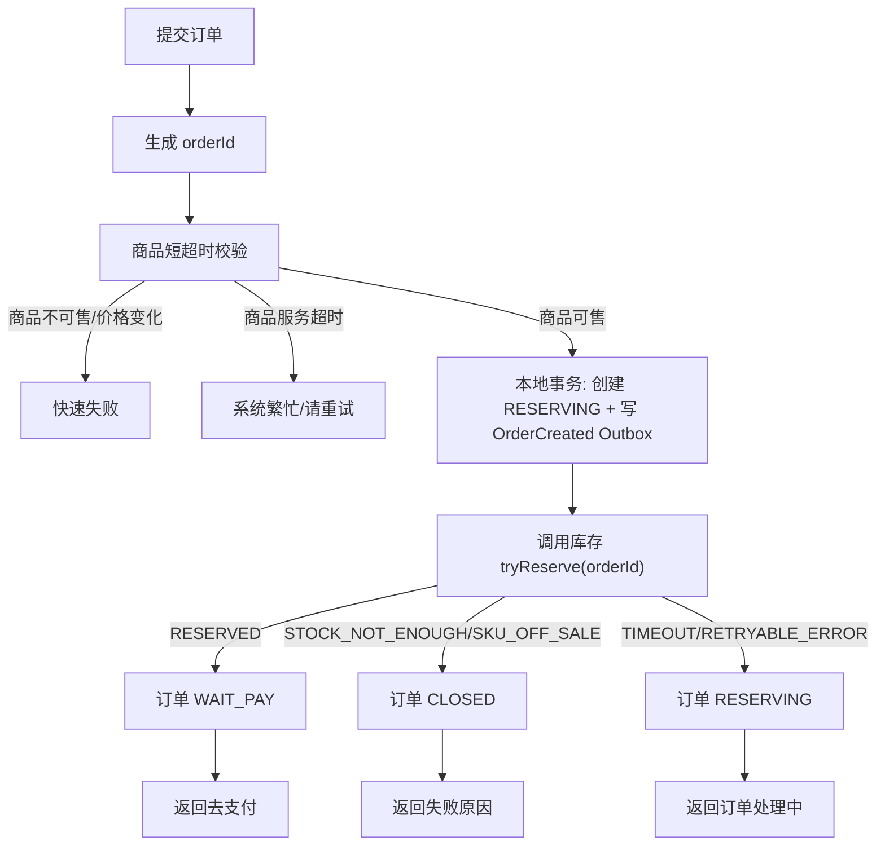
```mermaid
flowchart TD
  A["提交订单"] --> B["生成 orderId"]
  B --> C["商品短超时校验"]
  C -->|商品不可售/价格变化| D["快速失败"]
  C -->|商品服务超时| E["系统繁忙/请重试"]
  C -->|商品可售| F["本地事务: 创建 RESERVING + 写 OrderCreated Outbox"]
  F --> G["调用库存 tryReserve(orderId)"]
  G -->|RESERVED| H["订单 WAIT_PAY"]
  G -->|STOCK_NOT_ENOUGH/SKU_OFF_SALE| I["订单 CLOSED"]
  G -->|TIMEOUT/RETRYABLE_ERROR| J["订单 RESERVING"]
  H --> K["返回去支付"]
  I --> L["返回失败原因"]
  J --> M["返回订单处理中"]
```

订单服务伪代码：

```java
public CreateOrderResult createOrder(CreateOrderCommand cmd) {
    String orderId = idGenerator.nextId();

    ProductCheckResult product = productClient.check(cmd.items(), 300);
    if (product.bizFailed()) {
        return CreateOrderResult.fail(product.code(), product.message());
    }
    if (product.retryableFailed()) {
        return CreateOrderResult.busy("系统繁忙，请稍后重试");
    }

    orderTransactionService.createReservingOrder(orderId, cmd);

    ReserveResult reserve = inventoryClient.tryReserve(orderId, cmd.items(), 800);
    if (reserve.success()) {
        orderTransactionService.markWaitPay(orderId);
        return CreateOrderResult.waitPay(orderId);
    }
    if (reserve.bizFailed()) {
        orderTransactionService.close(orderId, reserve.message());
        return CreateOrderResult.fail(reserve.code(), reserve.message());
    }

    return CreateOrderResult.processing(orderId, "订单处理中");
}
```

本地事务：

```java
public void createReservingOrder(String orderId, CreateOrderCommand cmd) {
    transactionTemplate.executeWithoutResult(status -> {
        orderRepository.save(Order.reserving(orderId, cmd));
        outbox.save("OrderCreated", orderId, payload(cmd));
    });
}
```

## 10. 库存预占流程

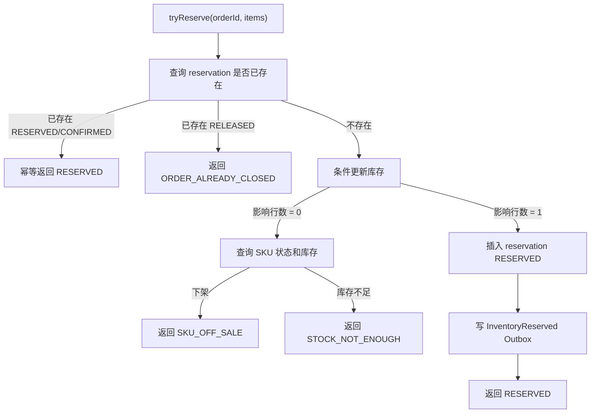
```mermaid
flowchart TD
  A["tryReserve(orderId, items)"] --> B["查询 reservation 是否已存在"]
  B -->|已存在 RESERVED/CONFIRMED| C["幂等返回 RESERVED"]
  B -->|已存在 RELEASED| D["返回 ORDER_ALREADY_CLOSED"]
  B -->|不存在| E["条件更新库存"]
  E -->|影响行数 = 1| F["插入 reservation RESERVED"]
  E -->|影响行数 = 0| G["查询 SKU 状态和库存"]
  G -->|下架| H["返回 SKU_OFF_SALE"]
  G -->|库存不足| I["返回 STOCK_NOT_ENOUGH"]
  F --> J["写 InventoryReserved Outbox"]
  J --> K["返回 RESERVED"]
```

库存服务伪代码：

```java
public ReserveResult tryReserve(ReserveCommand cmd) {
    return transactionTemplate.execute(status -> {
        Reservation existing = reservationRepository.findByOrderId(cmd.orderId());
        if (existing != null) {
            if (existing.isReservedOrConfirmed()) {
                return ReserveResult.success();
            }
            if (existing.isReleased()) {
                return ReserveResult.bizFailed("ORDER_ALREADY_CLOSED", "订单已关闭");
            }
        }

        for (ReserveItem item : cmd.items()) {
            int updated = stockRepository.reserve(item.skuId(), item.quantity());
            if (updated == 0) {
                SkuStock stock = stockRepository.findBySkuId(item.skuId());
                if (stock == null || stock.offSale()) {
                    return ReserveResult.bizFailed("SKU_OFF_SALE", "商品已下架");
                }
                return ReserveResult.bizFailed("STOCK_NOT_ENOUGH", "库存不足");
            }
        }

        reservationRepository.saveReserved(cmd.orderId(), cmd.items());
        outbox.save("InventoryReserved", cmd.orderId(), payload(cmd));
        return ReserveResult.success();
    });
}
```

条件更新：

```sql
UPDATE inventory_stock
SET available_stock = available_stock - #{quantity},
    locked_stock = locked_stock + #{quantity},
    update_time = NOW()
WHERE sku_id = #{skuId}
  AND status = 'ON_SALE'
  AND available_stock >= #{quantity};
```

## 11. 支付成功后的最终一致

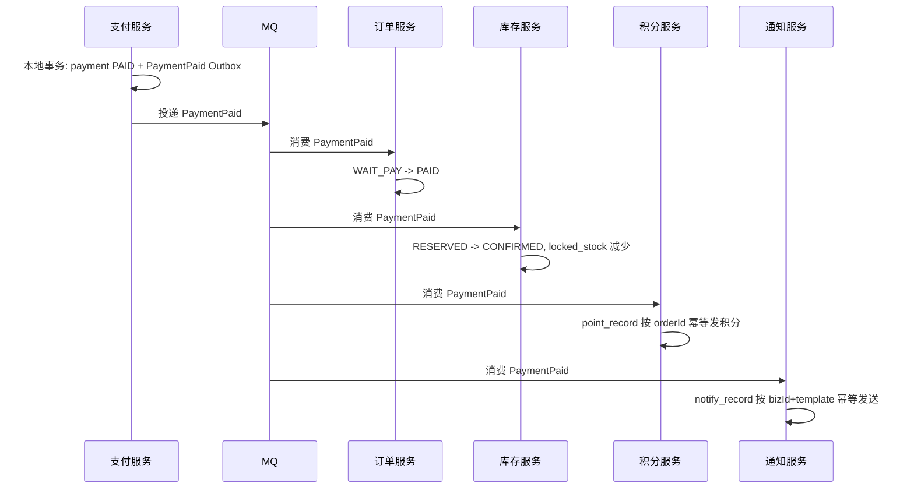
```mermaid
sequenceDiagram
  participant Pay as 支付服务
  participant MQ as MQ
  participant Order as 订单服务
  participant Inventory as 库存服务
  participant Point as 积分服务
  participant Notify as 通知服务

  Pay->>Pay: 本地事务: payment PAID + PaymentPaid Outbox
  Pay->>MQ: 投递 PaymentPaid
  MQ->>Order: 消费 PaymentPaid
  Order->>Order: WAIT_PAY -> PAID
  MQ->>Inventory: 消费 PaymentPaid
  Inventory->>Inventory: RESERVED -> CONFIRMED, locked_stock 减少
  MQ->>Point: 消费 PaymentPaid
  Point->>Point: point_record 按 orderId 幂等发积分
  MQ->>Notify: 消费 PaymentPaid
  Notify->>Notify: notify_record 按 bizId+template 幂等发送
```

支付服务：

```java
public void handlePayCallback(PayCallback callback) {
    transactionTemplate.executeWithoutResult(status -> {
        paymentRepository.markPaid(callback.payNo());
        outbox.save("PaymentPaid", callback.orderId(), payload(callback));
    });
}
```

订单服务消费：

```java
public void onPaymentPaid(PaymentPaid event) {
    transactionTemplate.executeWithoutResult(status -> {
        if (!inbox.tryStart(event.messageId(), "order-service")) {
            return;
        }

        Order order = orderRepository.findById(event.orderId());
        if (order.isWaitPay()) {
            orderRepository.markPaid(event.orderId());
            outbox.save("OrderPaid", event.orderId(), payload(event));
        }

        inbox.markSuccess(event.messageId(), "order-service");
    });
}
```

库存服务消费：

```java
public void onPaymentPaid(PaymentPaid event) {
    transactionTemplate.executeWithoutResult(status -> {
        if (!inbox.tryStart(event.messageId(), "inventory-service")) {
            return;
        }

        Reservation reservation = reservationRepository.findByOrderId(event.orderId());
        if (reservation.isReserved()) {
            reservationRepository.confirm(event.orderId());
            stockRepository.decreaseLockedStock(event.orderId());
            outbox.save("InventoryConfirmed", event.orderId(), payload(event));
        }

        inbox.markSuccess(event.messageId(), "inventory-service");
    });
}
```

## 12. 支付超时和释放库存

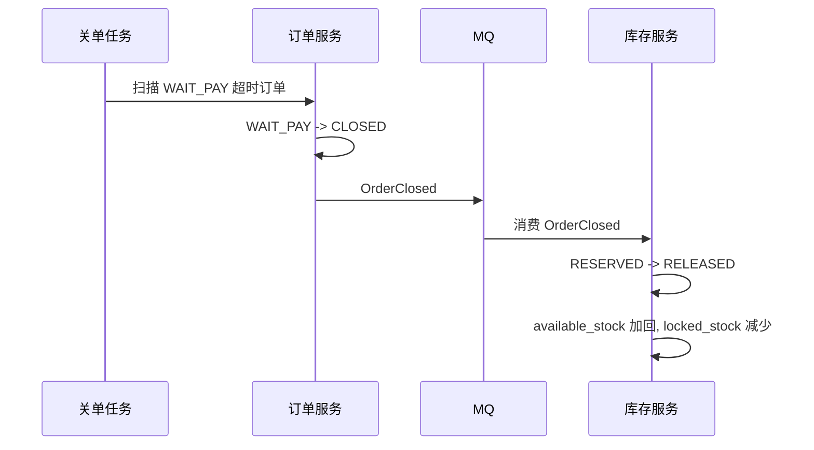
```mermaid
sequenceDiagram
  participant Job as 关单任务
  participant Order as 订单服务
  participant MQ as MQ
  participant Inventory as 库存服务

  Job->>Order: 扫描 WAIT_PAY 超时订单
  Order->>Order: WAIT_PAY -> CLOSED
  Order->>MQ: OrderClosed
  MQ->>Inventory: 消费 OrderClosed
  Inventory->>Inventory: RESERVED -> RELEASED
  Inventory->>Inventory: available_stock 加回, locked_stock 减少
```

订单关单：

```java
public void closePayTimeoutOrder(String orderId) {
    transactionTemplate.executeWithoutResult(status -> {
        Order order = orderRepository.findById(orderId);
        if (!order.isWaitPay()) {
            return;
        }

        orderRepository.close(orderId, "支付超时");
        outbox.save("OrderClosed", orderId, payload(orderId));
    });
}
```

库存释放：

```java
public void onOrderClosed(OrderClosed event) {
    transactionTemplate.executeWithoutResult(status -> {
        if (!inbox.tryStart(event.messageId(), "inventory-service")) {
            return;
        }

        Reservation reservation = reservationRepository.findByOrderId(event.orderId());
        if (reservation.isReserved()) {
            reservationRepository.release(event.orderId());
            stockRepository.releaseReservedStock(event.orderId());
            outbox.save("InventoryReleased", event.orderId(), payload(event));
        }

        inbox.markSuccess(event.messageId(), "inventory-service");
    });
}
```

## 13. 异常处理矩阵

| 异常点 | 可能状态 | 处理方式 | 是否用户立即失败 |
|---|---|---|---:|
| 商品服务返回下架 | 订单未创建或 RESERVING | 订单 CLOSED 或直接失败 | 是 |
| 商品服务超时 | 订单未创建 | 返回系统繁忙，用户重试 | 否 |
| 库存返回不足 | 订单 RESERVING | 订单 CLOSED | 是 |
| 库存返回下架 | 订单 RESERVING | 订单 CLOSED | 是 |
| 库存服务超时 | 订单 RESERVING | 返回处理中，后台继续预占 | 否 |
| 订单改 WAIT_PAY 失败 | 库存可能 RESERVED | InventoryReserved 消息或对账修正 | 否 |
| Outbox 投递 MQ 失败 | 消息 PENDING/FAILED | 投递器重试 | 否 |
| MQ 重复投递 | 消费端收到重复消息 | Inbox 唯一键幂等 | 否 |
| 消费者业务失败 | 消息未成功消费 | MQ/失败表重试，超过次数 DEAD | 否 |
| 支付成功后订单服务挂 | 支付 PAID，订单 WAIT_PAY | PaymentPaid 重试，订单最终 PAID | 否 |
| 支付成功后库存服务挂 | 订单 PAID，库存 RESERVED | PaymentPaid 重试，库存最终 CONFIRMED | 否 |
| 积分服务挂 | 订单 PAID | 积分消息重试，不影响订单 | 否 |
| 通知服务挂 | 订单 PAID | 通知消息重试，不影响订单 | 否 |
| 支付超时关单消息失败 | 订单 CLOSED，库存 RESERVED | OrderClosed Outbox 重试释放库存 | 否 |
| 消息长期失败 | 状态卡住 | 进入 DEAD，后台人工补偿 | 否 |

## 14. 异常流程图

异常流程的核心原则：

- 业务确定失败，立即结束当前链路，并把明确原因返回用户。
- 技术不确定失败，不伪装成业务失败，进入处理中、重试或补偿。
- 已经发生的本地事务不能跨服务回滚，只能通过反向事件或补偿动作修正。
- 所有异常路径必须有最终归宿：成功、业务关闭、自动重试、DEAD、人工补偿。

### 14.1 商品服务异常

商品校验在订单创建前执行。商品服务明确返回业务失败时，可以快速失败；商品服务超时或不可用时，订单服务通常不创建订单，直接提示稍后重试。

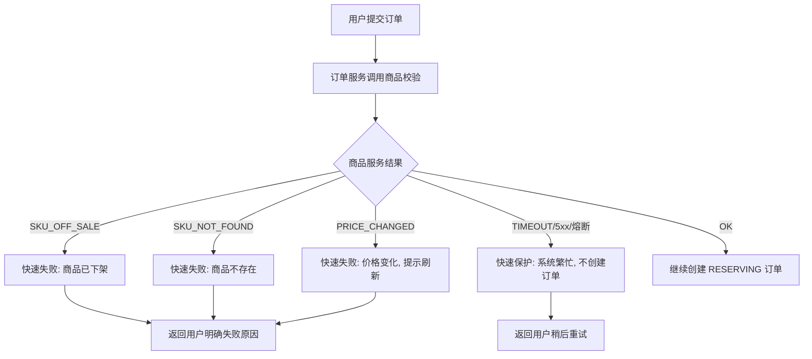
```mermaid
flowchart TD
  A["用户提交订单"] --> B["订单服务调用商品校验"]
  B --> C{"商品服务结果"}
  C -->|SKU_OFF_SALE| D["快速失败: 商品已下架"]
  C -->|SKU_NOT_FOUND| E["快速失败: 商品不存在"]
  C -->|PRICE_CHANGED| F["快速失败: 价格变化, 提示刷新"]
  C -->|TIMEOUT/5xx/熔断| G["快速保护: 系统繁忙, 不创建订单"]
  C -->|OK| H["继续创建 RESERVING 订单"]
  D --> I["返回用户明确失败原因"]
  E --> I
  F --> I
  G --> J["返回用户稍后重试"]
```

处理要求：

- 商品校验接口超时建议 `300ms` 左右。
- 商品服务技术异常时，不创建订单可以减少后续补偿复杂度。
- 如果业务要求必须保留用户下单痕迹，可以创建 `CLOSED` 订单，但不要进入库存预占。

### 14.2 库存服务业务失败

库存服务已经明确判断为库存不足、库存侧 SKU 下架、限购不满足时，订单可以快速关闭，并把原因返回用户。

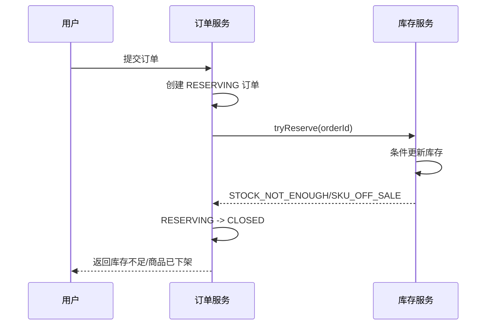
```mermaid
sequenceDiagram
  participant User as 用户
  participant Order as 订单服务
  participant Inventory as 库存服务

  User->>Order: 提交订单
  Order->>Order: 创建 RESERVING 订单
  Order->>Inventory: tryReserve(orderId)
  Inventory->>Inventory: 条件更新库存
  Inventory-->>Order: STOCK_NOT_ENOUGH/SKU_OFF_SALE
  Order->>Order: RESERVING -> CLOSED
  Order-->>User: 返回库存不足/商品已下架
```

处理要求：

- 只有库存服务明确返回业务失败，订单服务才能关闭订单并提示用户。
- 库存不足不需要重试，因为重试不会改变本次请求的业务事实。
- 订单关闭时记录 `close_reason`，用于客服和排障。

### 14.3 库存服务技术异常

库存服务超时、数据库死锁、连接池满、线程池满、熔断打开，都属于不确定结果。订单服务不能告诉用户库存不足。

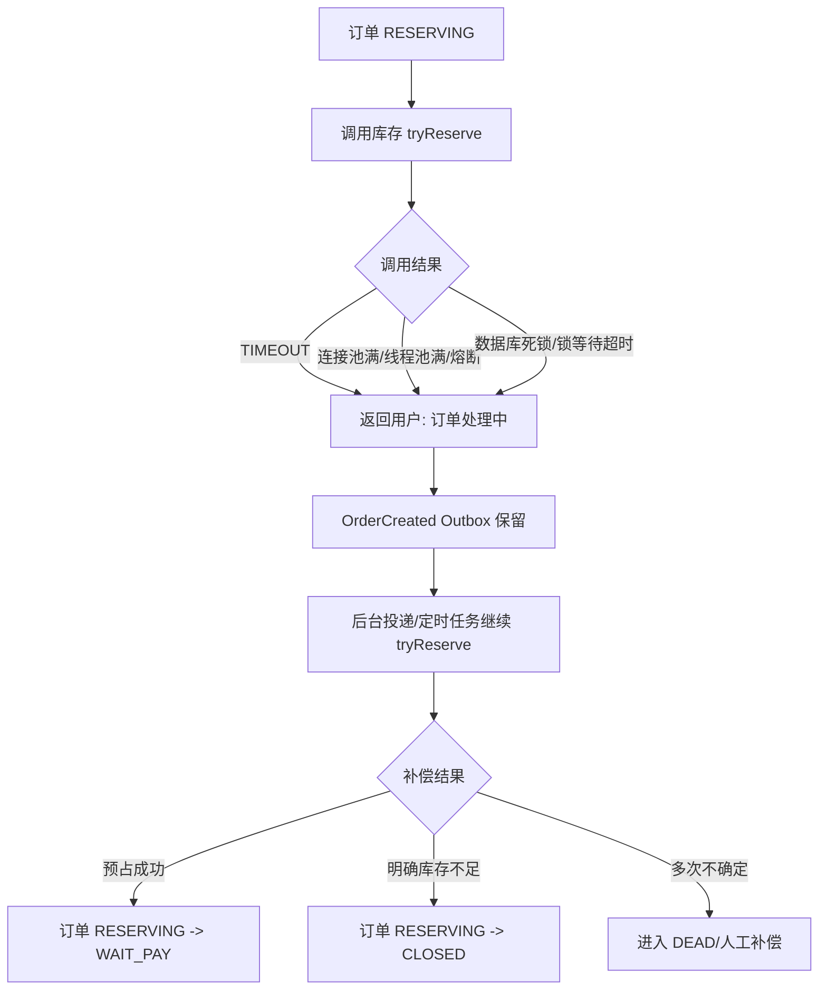
```mermaid
flowchart TD
  A["订单 RESERVING"] --> B["调用库存 tryReserve"]
  B --> C{"调用结果"}
  C -->|TIMEOUT| D["返回用户: 订单处理中"]
  C -->|连接池满/线程池满/熔断| D
  C -->|数据库死锁/锁等待超时| D
  D --> E["OrderCreated Outbox 保留"]
  E --> F["后台投递/定时任务继续 tryReserve"]
  F --> G{"补偿结果"}
  G -->|预占成功| H["订单 RESERVING -> WAIT_PAY"]
  G -->|明确库存不足| I["订单 RESERVING -> CLOSED"]
  G -->|多次不确定| J["进入 DEAD/人工补偿"]
```

处理要求：

- 前端拿到 `ORDER_PROCESSING` 后轮询订单状态，或通过 WebSocket/SSE 接收状态变化。
- 后台重试要带同一个 `orderId`，库存接口必须幂等。
- 长时间 `RESERVING` 要告警，不能让用户订单无限处理中。

### 14.4 库存已预占但订单更新失败

这是典型中间态：库存服务已经预占成功，但订单服务在更新 `WAIT_PAY` 时失败或宕机。

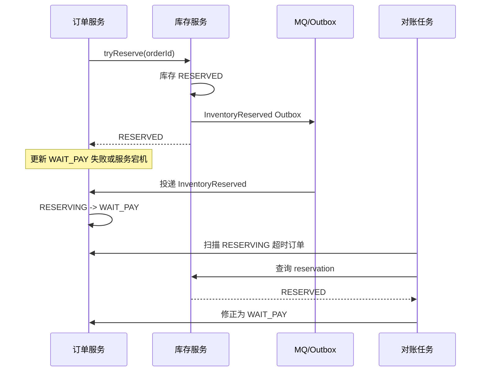
```mermaid
sequenceDiagram
  participant Order as 订单服务
  participant Inventory as 库存服务
  participant MQ as MQ/Outbox
  participant Job as 对账任务

  Order->>Inventory: tryReserve(orderId)
  Inventory->>Inventory: 库存 RESERVED
  Inventory->>MQ: InventoryReserved Outbox
  Inventory-->>Order: RESERVED
  Note over Order: 更新 WAIT_PAY 失败或服务宕机
  MQ->>Order: 投递 InventoryReserved
  Order->>Order: RESERVING -> WAIT_PAY
  Job->>Order: 扫描 RESERVING 超时订单
  Job->>Inventory: 查询 reservation
  Inventory-->>Job: RESERVED
  Job->>Order: 修正为 WAIT_PAY
```

处理要求：

- 库存服务预占成功后必须写 `InventoryReserved` Outbox。
- 订单服务消费 `InventoryReserved` 时，只允许 `RESERVING -> WAIT_PAY`。
- 对账任务作为消息丢失或长延迟的第二道兜底。

### 14.5 支付成功但订单消费失败

支付成功不能因为订单服务短暂故障而丢失。支付服务本地事务必须写 `PaymentPaid` Outbox。

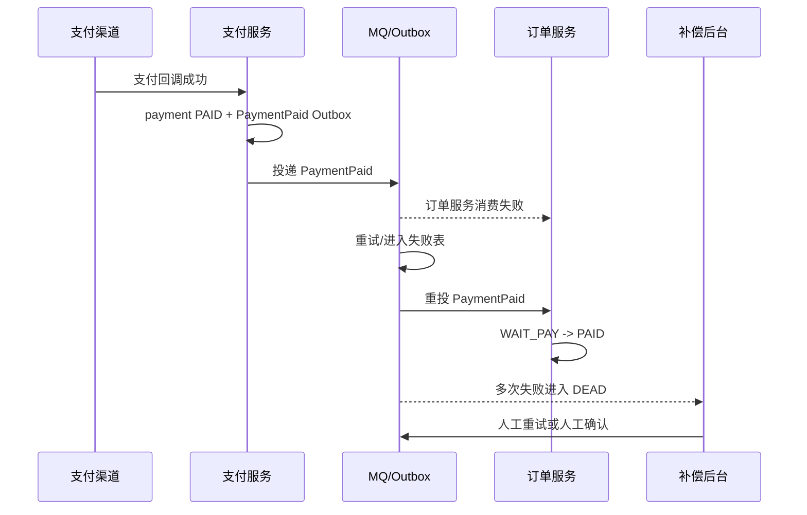
```mermaid
sequenceDiagram
  participant Channel as 支付渠道
  participant Pay as 支付服务
  participant MQ as MQ/Outbox
  participant Order as 订单服务
  participant Admin as 补偿后台

  Channel->>Pay: 支付回调成功
  Pay->>Pay: payment PAID + PaymentPaid Outbox
  Pay->>MQ: 投递 PaymentPaid
  MQ-->>Order: 订单服务消费失败
  MQ->>MQ: 重试/进入失败表
  MQ->>Order: 重投 PaymentPaid
  Order->>Order: WAIT_PAY -> PAID
  MQ-->>Admin: 多次失败进入 DEAD
  Admin->>MQ: 人工重试或人工确认
```

处理要求：

- 支付回调按支付单号幂等，重复回调不能重复写支付成功事件。
- 订单服务消费 `PaymentPaid` 按 `message_id + consumer_group` 幂等。
- 如果订单已 `CLOSED` 但支付成功，需要进入退款或人工异常单流程，不能静默忽略。

### 14.6 支付成功但库存确认失败

支付成功后，库存从 `RESERVED` 变成 `CONFIRMED`。如果库存服务消费失败，订单可以先保持 `PAID`，库存确认通过消息重试补齐。

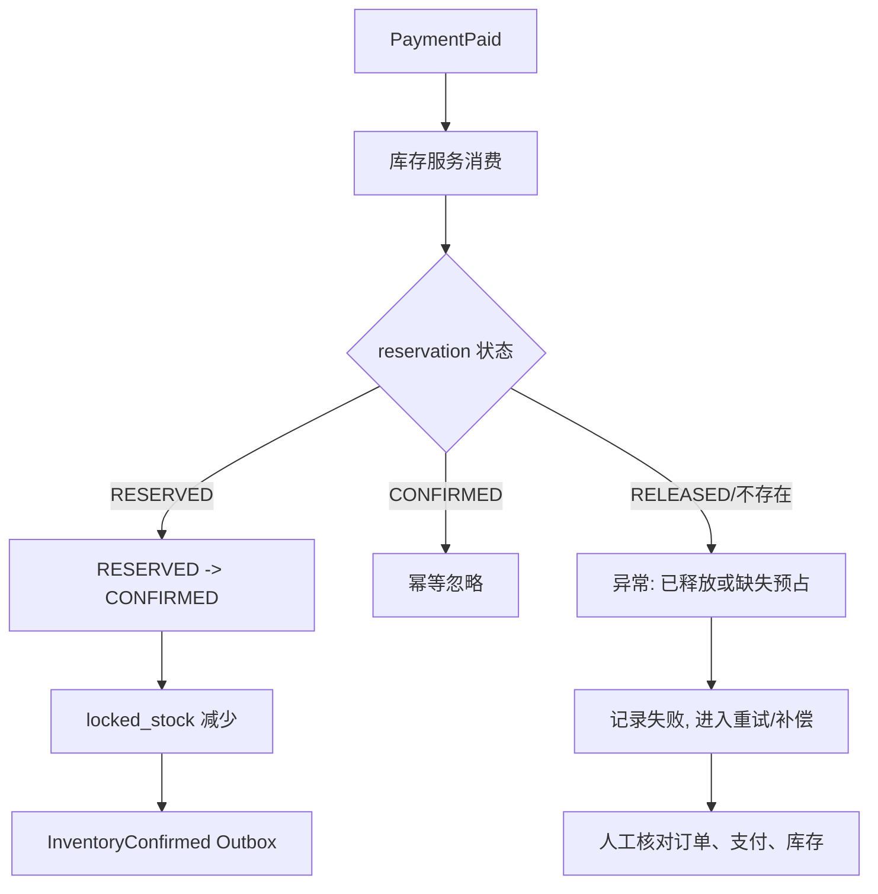
```mermaid
flowchart TD
  A["PaymentPaid"] --> B["库存服务消费"]
  B --> C{"reservation 状态"}
  C -->|RESERVED| D["RESERVED -> CONFIRMED"]
  C -->|CONFIRMED| E["幂等忽略"]
  C -->|RELEASED/不存在| F["异常: 已释放或缺失预占"]
  D --> G["locked_stock 减少"]
  G --> H["InventoryConfirmed Outbox"]
  F --> I["记录失败, 进入重试/补偿"]
  I --> J["人工核对订单、支付、库存"]
```

处理要求：

- `PaymentPaid` 消费不能重复减少 `locked_stock`。
- 找不到 reservation 时，要按异常处理，不要自动扣减可售库存。
- 库存确认失败超过阈值必须告警，因为这会影响库存准确性。

### 14.7 关单释放库存失败

订单关闭后，库存释放通过 `OrderClosed` 事件完成。如果释放失败，订单可以保持 `CLOSED`，库存服务必须继续重试释放。

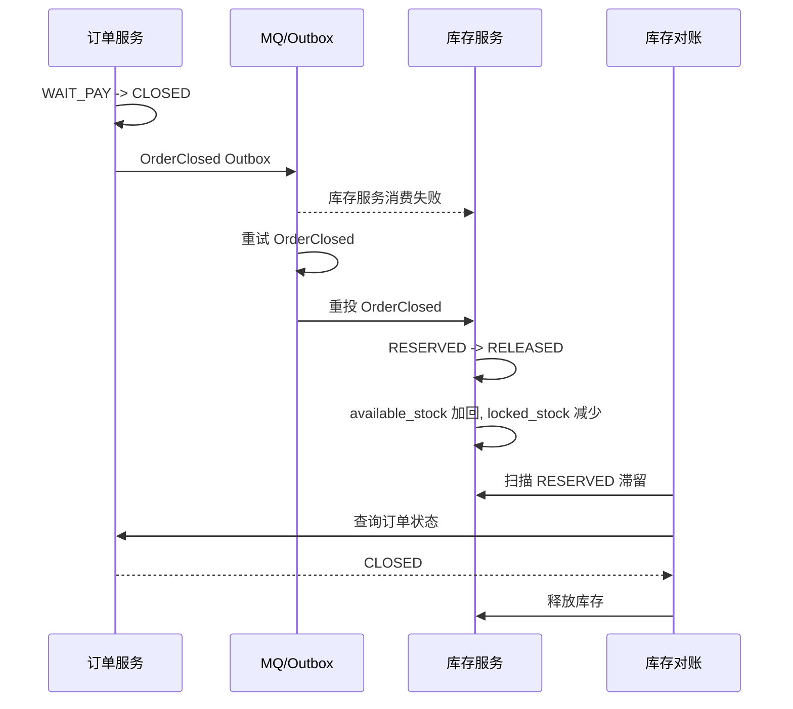
```mermaid
sequenceDiagram
  participant Order as 订单服务
  participant MQ as MQ/Outbox
  participant Inventory as 库存服务
  participant Job as 库存对账

  Order->>Order: WAIT_PAY -> CLOSED
  Order->>MQ: OrderClosed Outbox
  MQ-->>Inventory: 库存服务消费失败
  MQ->>MQ: 重试 OrderClosed
  MQ->>Inventory: 重投 OrderClosed
  Inventory->>Inventory: RESERVED -> RELEASED
  Inventory->>Inventory: available_stock 加回, locked_stock 减少
  Job->>Inventory: 扫描 RESERVED 滞留
  Job->>Order: 查询订单状态
  Order-->>Job: CLOSED
  Job->>Inventory: 释放库存
```

处理要求：

- 释放库存也必须幂等，`RELEASED` 状态重复释放不能再次加库存。
- `RESERVED` 超过支付超时时间必须扫描，避免库存长期锁住。
- 订单关闭和库存释放之间允许短暂不一致，但必须可观测。

### 14.8 Outbox 投递失败

Outbox 投递器只负责把本地消息可靠投递到 MQ。投递失败不能影响已经提交的业务事务。

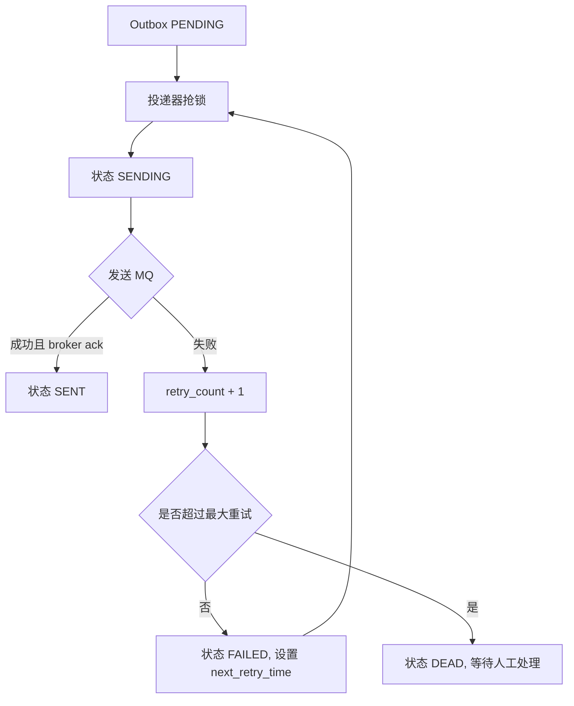
```mermaid
flowchart TD
  A["Outbox PENDING"] --> B["投递器抢锁"]
  B --> C["状态 SENDING"]
  C --> D{"发送 MQ"}
  D -->|成功且 broker ack| E["状态 SENT"]
  D -->|失败| F["retry_count + 1"]
  F --> G{"是否超过最大重试"}
  G -->|否| H["状态 FAILED, 设置 next_retry_time"]
  G -->|是| I["状态 DEAD, 等待人工处理"]
  H --> B
```

处理要求：

- 抢锁更新必须带状态条件，避免多实例重复投递。
- 发送成功但标记 `SENT` 前宕机，会导致重复投递，消费者必须幂等。
- `DEAD > 0` 必须告警。

### 14.9 MQ 重复、乱序和延迟

MQ 重复投递是常态，不是异常事故。消费者必须用 Inbox 和状态机兜住。

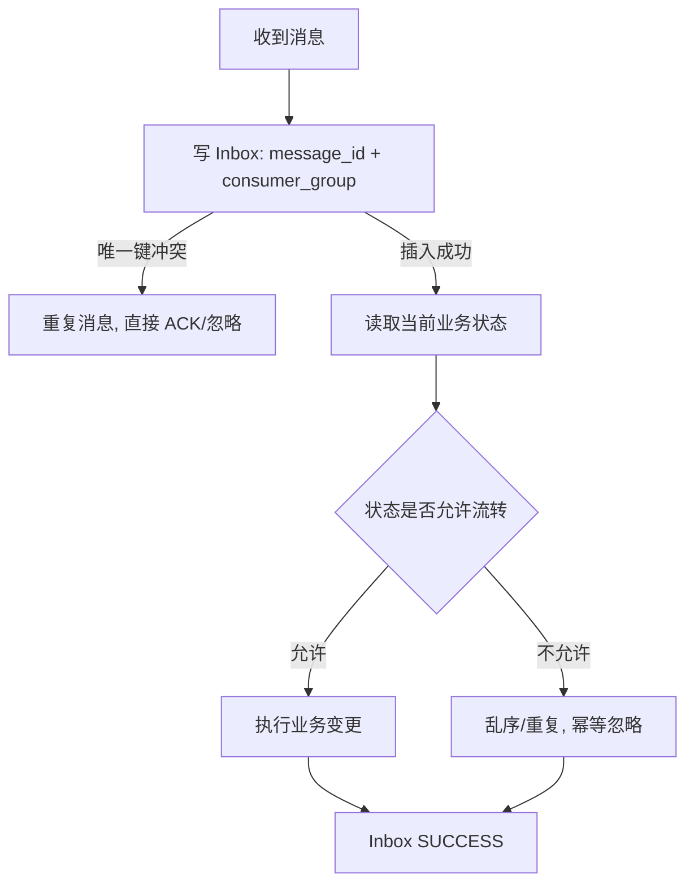
```mermaid
flowchart TD
  A["收到消息"] --> B["写 Inbox: message_id + consumer_group"]
  B -->|唯一键冲突| C["重复消息, 直接 ACK/忽略"]
  B -->|插入成功| D["读取当前业务状态"]
  D --> E{"状态是否允许流转"}
  E -->|允许| F["执行业务变更"]
  E -->|不允许| G["乱序/重复, 幂等忽略"]
  F --> H["Inbox SUCCESS"]
  G --> H
```

处理要求：

- Inbox 只能防消息重复，业务表唯一键和状态机也必须防重复。
- 乱序消息不能强行推进状态，例如 `CLOSED` 订单不能被迟到的 `InventoryReserved` 改成 `WAIT_PAY`。
- 消费失败时不要标记 Inbox 成功。

### 14.10 消息进入 DEAD 后的人工流程

消息多次重试失败后进入 `DEAD`，代表系统无法自动判断或自动处理，需要人工介入。

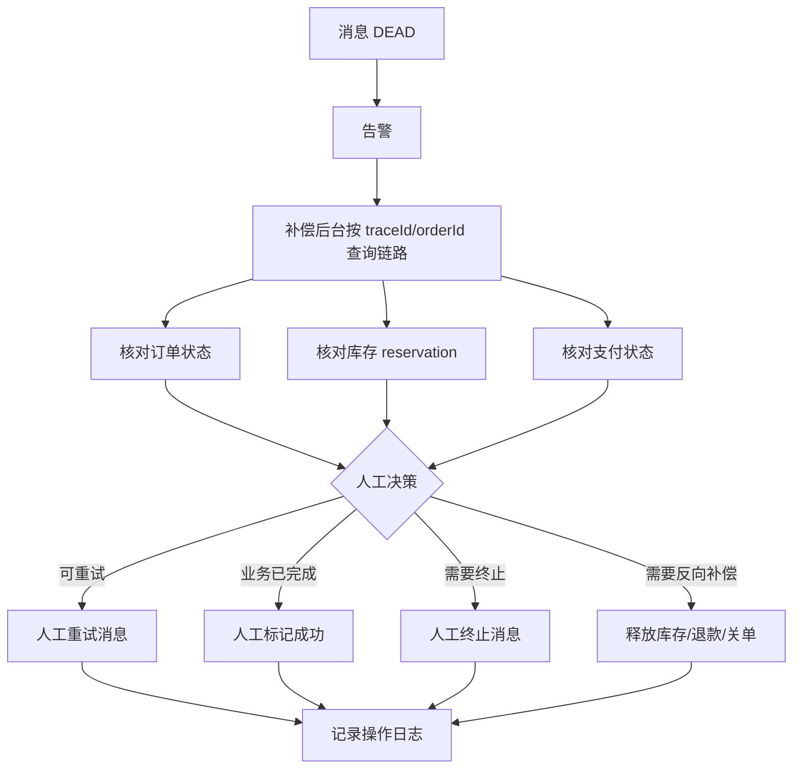
```mermaid
flowchart TD
  A["消息 DEAD"] --> B["告警"]
  B --> C["补偿后台按 traceId/orderId 查询链路"]
  C --> D["核对订单状态"]
  C --> E["核对库存 reservation"]
  C --> F["核对支付状态"]
  D --> G{"人工决策"}
  E --> G
  F --> G
  G -->|可重试| H["人工重试消息"]
  G -->|业务已完成| I["人工标记成功"]
  G -->|需要终止| J["人工终止消息"]
  G -->|需要反向补偿| K["释放库存/退款/关单"]
  H --> L["记录操作日志"]
  I --> L
  J --> L
  K --> L
```

处理要求：

- 人工操作必须记录操作人、原因、前后状态和 traceId。
- 人工标记成功只能用于业务已经通过其他方式完成的场景。
- 人工终止必须要求备注，避免把真实未完成任务静默丢弃。

## 15. 对账和补偿

### 15.1 自动对账

订单服务定时扫描：

| 条件 | 处理 |
|---|---|
| RESERVING 超过 30 秒 | 查询库存 reservation |
| 库存 RESERVED | 订单改 WAIT_PAY |
| 库存明确无 reservation 且库存服务可用 | 重新 tryReserve |
| 库存明确 REJECTED | 订单 CLOSED |
| 多次不确定 | 进入补偿后台 |

库存服务定时扫描：

| 条件 | 处理 |
|---|---|
| RESERVED 但订单 CLOSED | 释放库存 |
| RESERVED 但订单 PAID | 确认扣减 |
| RESERVED 超过支付超时时间 | 查询订单状态后释放或保留 |

支付服务定时扫描：

| 条件 | 处理 |
|---|---|
| 支付渠道已支付但本地未 PAID | 补写 PAID 和 PaymentPaid Outbox |
| 本地 PAID 但订单未 PAID | 重投 PaymentPaid |

### 15.2 人工补偿后台

后台必须支持：

- 按 `orderId`、`messageId`、`traceId` 查询链路。
- 查看订单、库存预占、支付、积分、通知状态。
- 查看 Outbox/Inbox 消息状态、重试次数、最后错误。
- 手动重试消息。
- 人工标记成功。
- 人工终止消息。
- 人工释放库存。
- 人工关闭订单。
- 所有人工动作写操作日志。

人工操作日志字段：

| 字段 | 含义 |
|---|---|
| operator_id | 操作人 |
| action | 重试、终止、人工成功、释放库存等 |
| resource_type | ORDER/MESSAGE/RESERVATION |
| resource_id | 订单 ID 或消息 ID |
| before_value | 操作前状态 |
| after_value | 操作后状态 |
| reason | 操作原因 |
| trace_id | 链路 ID |
| create_time | 操作时间 |

## 16. 完整例子

### 16.1 库存充足

```text
用户购买 SKU_001 两件。

1. 商品服务返回 SKU_001 可售，价格未变化。
2. 订单服务创建 RESERVING 订单。
3. 库存服务执行条件更新：available_stock - 2，locked_stock + 2。
4. 库存服务写 reservation，状态 RESERVED。
5. 订单服务收到 RESERVED，订单改 WAIT_PAY。
6. 用户支付。
7. 支付服务写 PaymentPaid Outbox。
8. 订单服务消费 PaymentPaid，WAIT_PAY -> PAID。
9. 库存服务消费 PaymentPaid，RESERVED -> CONFIRMED，locked_stock - 2。
10. 积分服务按 orderId 发积分。
11. 通知服务发送支付成功通知。
```

结果：

```text
订单 PAID
库存 CONFIRMED
积分已发
通知已发或可重试
```

### 16.2 库存不足

```text
用户购买 SKU_001 两件，但 available_stock = 1。

1. 商品服务返回可售。
2. 订单服务创建 RESERVING 订单。
3. 库存服务条件更新影响行数为 0。
4. 库存服务查询库存，确认 available_stock < 2。
5. 库存服务返回 STOCK_NOT_ENOUGH。
6. 订单服务 RESERVING -> CLOSED。
7. 接口返回用户：库存不足。
```

结果：

```text
订单 CLOSED
没有库存预占
用户第一时间知道库存不足
```

### 16.3 商品下架

```text
1. 订单服务短超时查询商品服务。
2. 商品服务返回 SKU_OFF_SALE。
3. 订单服务直接返回失败，或创建后立即 CLOSED。
4. 用户看到商品已下架。
```

结果：

```text
不进入库存预占
用户第一时间知道商品下架
```

### 16.4 库存服务超时

```text
1. 商品服务返回可售。
2. 订单服务创建 RESERVING 订单。
3. 订单服务调用库存 tryReserve，800ms 超时。
4. 订单服务不能判断库存是否不足。
5. 返回用户：订单处理中。
6. OrderCreated Outbox 继续推动库存预占。
7. 如果后续预占成功，订单变 WAIT_PAY，前端轮询到可支付。
8. 如果后续确认库存不足，订单变 CLOSED，前端展示库存不足。
9. 如果长期不确定，进入补偿后台。
```

结果：

```text
技术异常不会被错误展示为库存不足
用户看到处理中
系统继续自动收敛
```

### 16.5 支付成功但订单服务短暂故障

```text
1. 用户支付成功。
2. 支付服务本地 payment PAID，并写 PaymentPaid Outbox。
3. PaymentPaid 投递到 MQ。
4. 订单服务当时不可用，消费失败。
5. MQ 或失败消息表重试。
6. 订单服务恢复后消费 PaymentPaid。
7. 订单 WAIT_PAY -> PAID。
```

结果：

```text
支付不会丢
订单最终 PAID
```

### 16.6 支付超时释放库存

```text
1. 订单 WAIT_PAY 超过 15 分钟。
2. 订单服务关单，WAIT_PAY -> CLOSED。
3. 订单服务写 OrderClosed Outbox。
4. 库存服务消费 OrderClosed。
5. reservation RESERVED -> RELEASED。
6. available_stock 加回，locked_stock 减少。
```

结果：

```text
订单 CLOSED
库存释放
```

## 17. 接口契约

### 17.1 商品校验

```text
POST /products/check-sale
```

请求：

```json
{
  "items": [
    {
      "skuId": 1001,
      "quantity": 2,
      "priceSnapshot": "99.00"
    }
  ]
}
```

响应：

```json
{
  "success": true,
  "code": "OK",
  "message": "可售"
}
```

业务失败：

```json
{
  "success": false,
  "code": "SKU_OFF_SALE",
  "message": "商品已下架"
}
```

### 17.2 库存预占

```text
POST /inventory/reservations
```

请求：

```json
{
  "orderId": "1000001",
  "items": [
    {
      "skuId": 1001,
      "quantity": 2
    }
  ],
  "traceId": "trace-xxx"
}
```

成功：

```json
{
  "success": true,
  "code": "RESERVED",
  "message": "预占成功"
}
```

业务失败：

```json
{
  "success": false,
  "code": "STOCK_NOT_ENOUGH",
  "message": "库存不足"
}
```

技术失败：

```json
{
  "success": false,
  "code": "RETRYABLE_ERROR",
  "message": "库存服务暂时不可用"
}
```

## 18. 监控告警

必须监控：

| 指标 | 告警建议 |
|---|---|
| RESERVING 订单数量 | 连续增长告警 |
| RESERVING 最长滞留时间 | 超过 1 分钟告警 |
| WAIT_PAY 超时未关闭数量 | 大于 0 告警 |
| Outbox FAILED 数量 | 连续增长告警 |
| Outbox DEAD 数量 | 大于 0 告警 |
| Inbox 消费失败率 | 超过阈值告警 |
| PaymentPaid 未完成消费数量 | 超过阈值告警 |
| RESERVED 库存滞留数量 | 超过阈值告警 |
| 库存预占接口 P95/P99 | 超过 SLA 告警 |
| 商品/库存服务熔断次数 | 连续触发告警 |

## 19. 落地清单

- 订单、库存、支付服务都接入 Outbox。
- 所有消费者都接入 Inbox 幂等。
- 订单状态机禁止非法状态流转。
- 库存预占使用条件更新，避免超卖。
- 库存预占接口按 `orderId + skuId` 幂等。
- 支付回调按支付单号幂等。
- 积分发放按 `orderId` 幂等。
- 通知发送按 `bizId + templateCode` 幂等。
- 同步商品校验设置短超时。
- 同步库存预占设置短超时。
- 明确区分业务失败和技术失败。
- RESERVING 订单要有自动补偿任务。
- WAIT_PAY 订单要有超时关单任务。
- RESERVED 库存要有释放和确认对账任务。
- 补偿后台支持查链路、重试、终止、人工成功。
- 所有消息和日志带 `traceId`。

## 20. 和当前框架模块的关系

| 能力 | 建议承载模块 |
|---|---|
| Outbox 本地消息、重试调度 | `framework-local-message` |
| MQ 投递、消费、失败记录 | `framework-mq` |
| Inbox 幂等 | `framework-idempotent` 或业务 Inbox 表 |
| traceId 生成和透传 | `framework-web`、`framework-feign`、`framework-mq` |
| 操作日志/API 日志 | `framework-log` |
| 熔断、重试、短超时 | `framework-retry` |
| 补偿后台 | `admin-service` |

## 21. 最终原则

```text
快速失败：只失败确定的业务错误。
快速保护：技术异常不乱判业务失败。
本地事务：每个服务只保证自己的数据正确。
最终一致：靠 Outbox、MQ、Inbox、状态机、重试、对账、补偿收敛。
工程兜底：所有失败可查、可重试、可人工处理。
```
